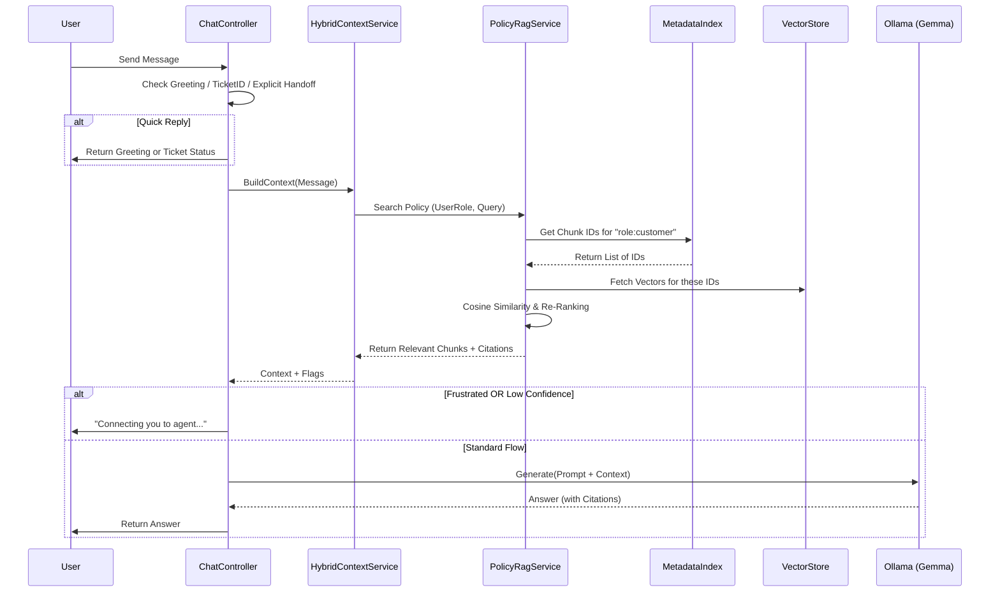

# HealthBot AI Workflow

This document outlines the architecture and data flow of the HealthBot AI application.

## 1. High-Level Architecture

The HealthBot is a .NET Web API that interfaces with a Frontend (Blazor/React) and a Local LLM (Ollama).

**Core Components:**
- **HealthBot.Api**: The backend handling logic, context management, and API endpoints.
- **Ollama (Local LLM)**: Hosts the `gemma3:4b` model for generating responses.
- **DynamoDB**:
    - `DynamoConversationMemory`: Stores chat history.
    - `VectorStore`: Stores document chunks and embeddings.
    - `HealthBot_MetadataIndex`: **[NEW]** An inverted index for fast metadata filtering (e.g., `role:customer` -> `[ChunkId1, ChunkId2]`).
- **AWS S3**: Stores policy documents which are indexed into vectors.

---

## 2. Request Lifecycle (The "Chat" Flow)

When a user sends a message, it follows this pipeline in `ChatController.cs`:

### Step 1: Immediate Checks (Short-Circuits)
Before involving the AI, the system deals with specific cases instantly:
1.  **Greeting Check**: If the user says "Hi", "Hello", etc., the bot responds with a standard greeting immediately.
2.  **Ticket Status**: If the message contains `TKT-XXXX`, the system looks up the ticket in DynamoDB and returns its status.
3.  **Explicit Handoff**: If the user asks to "talk to agent" or "support", a ticket is created instantly, and the bot responds with the ticket ID.

### Step 2: Context Building (`HybridContextService`)
If no short-curcuit triggers, the system builds the context for the AI:
1.  **Conversation History**: Fetches the last 6 messages from DynamoDB.
2.  **Frustration Detection**: Checks for keywords like "stupid", "broken" or repeated confusion. If detected, `IsFrustrated` flag is set.
3.  **Metadata-Driven RAG (Policy Search)**:
    *   **Filter**: Checks `HealthBot_MetadataIndex` for chunks matching the user's role (e.g., `role:customer`).
    *   **Embed**: Embeds the user's question using `EmbeddingService`.
    *   **Search**: Searches *only* the filtered chunks in `VectorStore` (Vector Search).
    *   **Re-Rank**: combined score = `0.7 * SemanticSimilarity + 0.3 * MetadataConfidence`.
    *   **Result**: Returns top matching chunks with **Citations** (e.g., `[Source: Gold Plan]`).

### Step 3: Handoff Logic
Before generating an answer, the system checks the flags from Step 2:
*   **Frustrated User**: Auto-creates a ticket and replies: *"I see we're going in circles... I've created a ticket."*
*   **Low Confidence (Unknown Policy)**: If RAG failed but the user asked about insurance, it auto-creates a ticket and replies: *"I couldn't find details... I've connected you to an agent."*

### Step 4: AI Generation (`LocalLlmService`)
If no handoff is needed, the system generates a response:
1.  **Prompt Construction**: A system prompt is built containing:
    *   Identity Rules ("You are an AI for hospital insurance...").
    *   Context (Conversation History + Policy Chunks w/ Citations).
    *   The User's Question.
2.  **Ollama Inference**: The prompt is sent to `http://localhost:11434/api/generate` (Model: `gemma3:4b`).
3.  **Response**: The generated text is returned, citing the sources provided in the context.

### Step 5: Persistence
1.  The User's question is saved to `DynamoConversationMemory`.
2.  The AI's Answer (or the Handoff message) is saved to Memory.

---

## 3. Key Services

### `LocalLlmService`
- **Role**: Interface to the Ollama server.
- **Model**: `gemma3:4b`.
- **Endpoint**: `POST /api/generate`.
- **Function**: Handles both chat generation and intent classification (if enabled).

### `PolicyRagService`
- **Role**: Manages the Knowledge Base and Metadata Index.
- **Indexing**:
    1.  Chunks text and generates embeddings.
    2.  Stores Chunks in `VectorStore`.
    3.  Updates Inverted Index in `HealthBot_MetadataIndex` (Term -> ChunkIds).
- **Retrieval**: 
    1.  **Metadata Filter**: Gets candidate ID list from Index.
    2.  **Vector Search**: Scans only candidate chunks.
    3.  **Re-Ranking**: Boosts results based on metadata confidence.

### `HybridContextService`
- **Role**: The "Brain" that decides *what* the AI should know.
- **Logic**: Combines History + RAG + Heuristics (Frustration/Confusion analysis).

### `TicketService`
- **Role**: Manages Support Tickets.
- **Storage**: DynamoDB.
- **Function**: Creates tickets (`TKT-XXXX`) when the AI cannot handle a request or when requested by the user.

---

## 4. Data Flow Diagram

