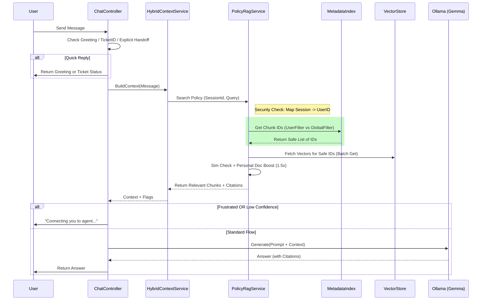

# HealthBot AI Workflow

This document outlines the architecture and data flow of the HealthBot AI application.

## 1. High-Level Architecture

The HealthBot is a .NET Web API that interfaces with a Frontend (Blazor/React) and a Local LLM (Ollama).

**Core Components:**
- **HealthBot.Api**: The backend handling logic, context management, and API endpoints.
- **Ollama (Local LLM)**: Hosts the `gemma3:4b` model for generating responses.
- **DynamoDB**:
    - `DynamoConversationMemory`: Stores chat history.
    - `VectorStore`: Stores document chunks and embeddings.
    - `HealthBot_MetadataIndex`: **[NEW]** An inverted index for fast metadata filtering (e.g., `role:customer` -> `[ChunkId1, ChunkId2]`).
- **AWS S3**: Stores policy documents which are indexed into vectors.

---

## 2. Request Lifecycle (The "Chat" Flow)

When a user sends a message, it follows this pipeline in `ChatController.cs`:

### Step 1: Immediate Checks (Short-Circuits)
Before involving the AI, the system deals with specific cases instantly:
1.  **Greeting Check**: If the user says "Hi", "Hello", etc., the bot responds with a standard greeting immediately.
2.  **Ticket Status**: If the message contains `TKT-XXXX`, the system looks up the ticket in DynamoDB and returns its status.
3.  **Explicit Handoff**: If the user asks to "talk to agent" or "support", a ticket is created instantly, and the bot responds with the ticket ID.

### Step 2: Context Building (`HybridContextService`)
If no short-curcuit triggers, the system builds the context for the AI:
1.  **Conversation History**: Fetches the last 6 messages from DynamoDB.
2.  **Frustration Detection**: Checks for keywords like "stupid", "broken" or repeated confusion. If detected, `IsFrustrated` flag is set.
3.  **Metadata-Driven RAG (Policy Search)**:
    *   **Filter**: 
        *   **Security Check**: Maps `SessionId` (e.g. `ui-session`) to User ID.
        *   **Isolation**: If global session, restricts view to `user_id:global` ONLY. If specific user, sees `user_id:global` AND `user_id:specific`.
    *   **Embed**: Embeds the user's question using `EmbeddingService`.
    *   **Search**: Searches *only* the filtered chunks in `VectorStore` (Vector Search).
    *   **Re-Rank**: 
        *   Checks `doc_type` metadata (`personal` vs `reference`).
        *   **Boost**: Applies **50% Score Boost** to Personal Documents.
        *   Formula: `Final = (0.7*Sim + 0.3*Conf) * (isPersonal ? 1.5 : 1.0)`.
    *   **Result**: Returns top matching chunks with **Citations**.

### Step 3: Handoff Logic
Before generating an answer, the system checks the flags from Step 2:
*   **Frustrated User**: Auto-creates a ticket and replies.
*   **Low Confidence**: If RAG failed but the user asked about insurance, handoff.

### Step 4: AI Generation (`LocalLlmService`)
If no handoff is needed, the system generates a response using Ollama (`gemma3:4b`).

### Step 5: Persistence & Management
1.  **Chat History**: Saved to `DynamoConversationMemory`.
2.  **History Management**: Endpoint `DELETE /chat/{sessionId}` allows clearing history to prevent context pollution.

---

## 3. Key Services

### `LocalLlmService`
- **Role**: Interface to the Ollama server.
- **Model**: `gemma3:4b`.

### `PolicyRagService` (Enhanced)
- **Role**: Manages the Knowledge Base, Metadata Index, and **Smart Sync**.
- **Syncing**:
    1.  **Incremental Sync**: Auto-detects modified S3 files via timestamps.
    2.  **Background Service**: `RagSyncBackgroundService` checks every 5 minutes.
    3.  **Indexing**: Adds metadata (`doc_type`, `user_id`) for smart retrieval.
- **Retrieval**: 
    1.  **Session Isolation**: Enforces strict data visibility rules.
    2.  **Boosting**: Prioritizes personal content over generic FAQs.

### `HybridContextService`
- **Role**: The "Brain" that decides *what* the AI should know.

### `TicketService`
- **Role**: Manages Support Tickets.

---

## 4. Data Flow Diagram

